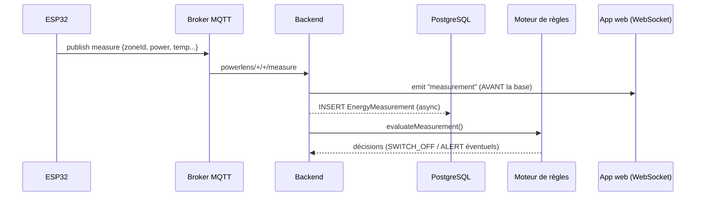
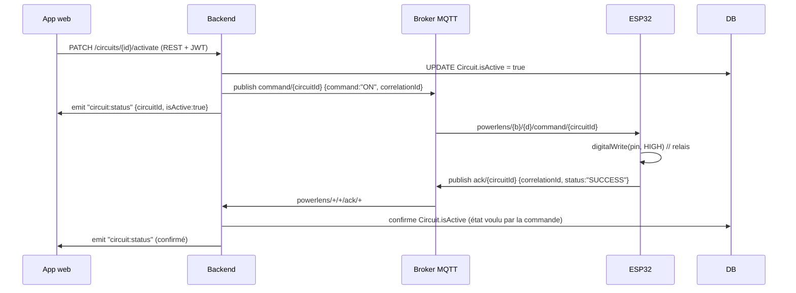

# Communication ESP32 ↔ Application web — PowerLens

> Description **complète** de la chaîne de communication entre le matériel
> (ESP32 + capteurs + relais) et l'application web, protocole par protocole :
> réseau, MQTT, backend, WebSocket. Ce document décrit le fonctionnement réel
> du code (`code_couloir.ino`, `code_salle.ino`, `powerlens-backend`,
> `powerlens-mobile`), pas une cible théorique.
>
> Documents liés : [`docs/mqtt.md`](docs/mqtt.md) · [`docs/websocket.md`](docs/websocket.md) · [`docs/architecture.md`](docs/architecture.md) · [`docs/hardware.md`](docs/hardware.md)

---

## Sommaire

1. [Vue d'ensemble](#1-vue-densemble)
2. [Les acteurs et leurs rôles](#2-les-acteurs-et-leurs-rôles)
3. [Couche réseau (prérequis physiques)](#3-couche-réseau-prérequis-physiques)
4. [Protocole MQTT](#4-protocole-mqtt)
5. [Les 5 flux de bout en bout](#5-les-5-flux-de-bout-en-bout)
6. [Couche WebSocket (backend → app)](#6-couche-websocket-backend--app)
7. [Bascule simulateur ↔ matériel réel](#7-bascule-simulateur--matériel-réel)
8. [Règles d'or de l'architecture](#8-règles-dor-de-larchitecture)
9. [Résilience & dépannage](#9-résilience--dépannage)
10. [Annexe — Identifiants réels de ce déploiement](#10-annexe--identifiants-réels-de-ce-déploiement)

---

## 1. Vue d'ensemble

La communication n'est **jamais directe** entre l'ESP32 et l'application. Elle
transite par un broker MQTT (messages matériels) puis par le backend NestJS
(logique métier), qui rediffuse en temps réel vers l'app via WebSocket.

```
┌──────────────┐   MQTT (Wi-Fi 2,4 GHz)   ┌──────────────┐   souscriptions   ┌────────────────────┐   WebSocket    ┌──────────────┐
│    ESP32     │ ───── mesures / ack ────► │    Broker    │ ────────────────► │   Backend NestJS   │ ─── push ────► │   App web    │
│ capteurs +   │                          │  Mosquitto   │                   │  (single source of │  measurement/  │ (Expo /RN    │
│ 3 relais     │ ◄──── commandes / ────── │   :1883      │ ◄──── publish ─── │      truth)        │  alert/status  │  Web :8081)  │
│              │       alertes buzzer      │              │                   │      :3000         │                │              │
└──────────────┘                          └──────────────┘                   └─────────┬──────────┘                └──────────────┘
                                                                                       │ Prisma (asynchrone, historique seulement)
                                                                                       ▼
                                                                              ┌────────────────────┐
                                                                              │  PostgreSQL :5434  │
                                                                              └────────────────────┘
```

Deux principes non négociables :

1. **Temps réel sans détour par la base** — une mesure MQTT est rediffusée par
   WebSocket **avant même** son écriture en PostgreSQL. La base ne sert que
   d'historique, jamais de source pour l'affichage live.
2. **Single point of truth** — toute la logique (auth, moteur de règles,
   commandes, journalisation) vit dans le backend. L'ESP obéit ; l'app affiche
   et demande. Aucun des deux ne décide.

---

## 2. Les acteurs et leurs rôles

| Acteur | Rôle dans la communication | Techno |
|---|---|---|
| **ESP32** | Publie les mesures de sa zone, s'abonne à ses commandes, actionne les relais, renvoie un ACK, joue le buzzer sur alerte | Arduino, `PubSubClient` (MQTT), `ArduinoJson` |
| **Broker MQTT** | Bus de messages (publish/subscribe) entre l'ESP et le backend | Mosquitto `:1883`, anonyme |
| **Backend NestJS** | Souscrit aux topics matériels, persiste, évalue les règles, publie les commandes, rediffuse en WebSocket. **Seul** à parler au broker côté serveur | NestJS 11, `mqtt`, `socket.io` |
| **PostgreSQL** | Historique des mesures, circuits, règles, alertes, audit | Prisma 7, `:5434` |
| **App web** | Client pur : affiche les mesures/états reçus par WebSocket, envoie les commandes par API REST | Expo / React Native Web, `socket.io-client`, `axios` |

> ⚠️ L'app **ne parle jamais** à MQTT ni à l'ESP directement. Une commande part
> en **REST** (`PATCH /circuits/:id/...`) → le backend la traduit en message MQTT.

---

## 3. Couche réseau (prérequis physiques)

Pour que l'ESP et le backend communiquent, ils doivent partager le même réseau IP.

| Élément | Contrainte | Où c'est configuré |
|---|---|---|
| **Wi-Fi** | **2,4 GHz obligatoire** — l'ESP32 ne capte pas le 5 GHz | `WIFI_SSID` / `WIFI_PASS` dans le `.ino` |
| **Même réseau** | ESP et PC (broker) sur le même LAN/hotspot | — |
| **IP du broker** | L'ESP doit connaître l'**IP du PC** sur ce réseau | `MQTT_HOST` dans le `.ino` |
| **Port MQTT** | `1883` ouvert et joignable depuis le LAN | broker bind `0.0.0.0:1883`, firewall |
| **AP isolation** | Doit être **désactivée** sur le hotspot (sinon clients isolés) | réglage du téléphone/routeur |

**Pièges classiques :**
- Hotspot en 5 GHz → l'ESP reste bloqué sur `WiFi ECHEC`.
- L'**IP du PC change** à chaque reconnexion au hotspot → `MQTT_HOST` devient
  obsolète → `WiFi OK` mais `MQTT ECHEC`. Relever l'IP (`ip -4 -o addr show <iface>`)
  et la reporter dans le `.ino` avant de reflasher.
- AP isolation active → l'ESP voit le Wi-Fi mais ne joint jamais le broker.

---

## 4. Protocole MQTT

### 4.1 Broker

- URL backend : `MQTT_BROKER_URL` (`.env`), défaut `mqtt://localhost:1883`.
- Client backend : `rule-engine-client` — `clean: true`,
  `connectTimeout: 4000 ms`, `reconnectPeriod: 2000 ms` (reconnexion infinie).
- Client ESP : `mqtt.connect(DEVICE_UID)` — le **`deviceUid`** sert d'ID client
  (⚠️ deux modules ne doivent pas partager le même `deviceUid`, collision).

### 4.2 Structure des topics

Tous les topics suivent le préfixe :

```
powerlens/{buildingId}/{deviceUid}/...
```

où `buildingId` = `Building.id` (UUID Prisma) et `deviceUid` = `Device.deviceUid`
(ex. `ESP32-PL-001`, **pas** l'UUID interne du device).

| Usage | Topic | Sens | QoS |
|---|---|---|---|
| **Mesures** | `powerlens/{building}/{device}/measure` | ESP → Backend | 0 |
| **Commandes** | `powerlens/{building}/{device}/command/{circuitId}` | Backend → ESP | 0 |
| **Accusés (ACK)** | `powerlens/{building}/{device}/ack/{circuitId}` | ESP → Backend | 0 |
| **Événements** | `powerlens/{building}/{device}/event` | ESP → Backend | 0 |
| **Alertes (buzzer)** | `powerlens/{building}/{device}/alert` | Backend → ESP | 0 |

**Souscriptions :**
- **Backend** (wildcards, `+` = un niveau) : `powerlens/+/+/measure`,
  `powerlens/+/+/ack/+`, `powerlens/+/+/event`.
- **ESP** : `powerlens/{building}/{device}/command/#` (ses commandes) et
  `powerlens/{building}/{device}/alert` (ses alertes).

Fonctions utilitaires backend : `measureTopic`, `commandTopic`, `ackTopic`,
`eventTopic`, `alertTopic`, `parseTopic` dans
[`src/mqtt/config/mqtt.config.ts`](powerlens-backend/src/mqtt/config/mqtt.config.ts).

### 4.3 Format des messages (JSON)

**Mesure** (`measure`) — publiée par l'ESP toutes les 5 s pour **chaque zone** :
```json
{
  "zoneId": "ea4e2852-...",         // zone ROOM ou CORRIDOR (jamais BUILDING)
  "measuredAt": "2026-07-14T10:15:30.000Z",  // ISO 8601 (horloge NTP de l'ESP)
  "voltage": 221.34,
  "current": 3.812,
  "power": 843.59,
  "energyKwh": 1.2456,               // compteur cumulé (jamais remis à 0)
  "frequency": 50.02,                // optionnel
  "powerFactor": 0.98,               // optionnel
  "presence": true,                  // optionnel (ROOM/CORRIDOR)
  "temperature": 27.5,               // optionnel (ROOM uniquement, sinon ignoré)
  "circuits": [                      // optionnel (V8) — état réel des relais
    { "circuitId": "3da50cd3-...", "isActive": true },
    { "circuitId": "ac85ac61-...", "isActive": false }
  ]
}
```

**Commande** (`command/{circuitId}`) — publiée par le backend :
```json
{
  "command": "ON",                             // "ON" | "OFF"
  "correlationId": "<circuitId>-<timestamp>",  // pour relier l'ACK
  "timestamp": "2026-07-14T10:15:31.000Z",
  "ruleId": "<uuid>"                           // présent seulement si déclenché par une règle
}
```

**Accusé de réception** (`ack/{circuitId}`) — publié par l'ESP :
```json
{ "correlationId": "<circuitId>-<timestamp>", "status": "SUCCESS" }  // ou "FAILURE"
```

**Événement** (`event`) — publié par l'ESP (déclenche les règles `EVENT`) :
```json
{ "eventName": "DOOR_OPEN", "circuitId": "<uuid, optionnel>" }
```

**Alerte** (`alert`) — publiée par le backend vers l'ESP (buzzer) :
```json
{ "alertId": "<uuid>", "level": "WARNING", "message": "...", "cleared": false }
```

---

## 5. Les 5 flux de bout en bout

### 5.1 Flux MESURE (ESP → App)



1. L'ESP lit ses capteurs, construit le JSON, `publish` sur `measure`.
2. Le backend reçoit (`MeasurementListener.handleMeasurement`).
3. **Diffusion WebSocket `measurement` immédiate** → l'app se met à jour.
4. Écriture PostgreSQL asynchrone (historique).
5. Évaluation des règles → peut déclencher une commande ou une alerte.

### 5.2 Flux COMMANDE + ACK (App → ESP → App)



1. L'utilisateur bascule un circuit dans l'app → **REST** `PATCH /circuits/:id/activate|deactivate`.
2. Le backend met à jour la base, **publie la commande MQTT**, émet un premier
   `circuit:status` (optimiste), et arme un *tracker* (`CommandTrackerService`).
3. L'ESP reçoit sur `command/#`, extrait le `circuitId` (dernier segment du
   topic), le cherche dans son tableau `circuits[]`, actionne la pin, renvoie un ACK.
4. Le backend reçoit l'ACK, confirme `Circuit.isActive` selon l'état **voulu par
   la commande d'origine** (mémorisé via `track()`), émet un `circuit:status` confirmé.
5. **Sans ACK** dans le délai `COMMAND_ACK_TIMEOUT_MS` → alerte `WARNING` +
   audit `COMMAND_TIMEOUT`.

> Correspondance clé : le topic contient le `circuitId` **de la base** ; le
> firmware ne réagit que si ce même `circuitId` figure dans son tableau
> `circuits[]` local (mappé à une pin GPIO). C'est ce mapping qui doit être
> aligné entre la base et le `.ino` (voir [annexe](#10-annexe--identifiants-réels-de-ce-déploiement)).

### 5.3 Flux ÉVÉNEMENT (ESP → règles)

L'ESP publie sur `event` (ex. `{"eventName":"DOOR_OPEN"}`). Le backend le passe
au moteur de règles (`RuleType.EVENT`), qui peut déclencher `SWITCH_OFF`/`ALERT`.

### 5.4 Flux ALERTE (Backend → ESP)

Quand une règle déclenche une action `ALERT`, le backend crée une ligne `Alert`,
émet un WebSocket `alert` **et** publie sur le topic `alert` du device concerné →
l'ESP déclenche son **buzzer** selon `level` (WARNING/CRITICAL). Un message
`{"cleared":true}` arrête le buzzer.

### 5.5 Flux COMMANDE par règle (automatique)

Identique à 5.2 mais l'émetteur n'est pas l'utilisateur : le moteur de règles
publie la commande avec un champ `ruleId`, et l'audit note `actorType: 'SYSTEM'`.

---

## 6. Couche WebSocket (backend → app)

- Basée sur **socket.io**, même hôte/port que l'API (`:3000`).
- CORS ouvert (`origin: '*'`), **pas d'authentification** (à sécuriser avant prod).
- **Diffusion uniquement** (`server.emit`) — le backend ne lit pas de messages
  entrants du client sur ce canal (les commandes passent par REST).

| Événement | Émis quand | Payload |
|---|---|---|
| `measurement` | mesure MQTT reçue | mesure + `buildingId`/`deviceId` |
| `circuit:status` | commande (API/règle) **ou** ACK matériel | `{ circuitId, isActive }` |
| `alert` | règle de type `ALERT` déclenchée | enregistrement `Alert` |
| `provider:switched` | bascule simulateur ↔ matériel | `"SIMULATOR"` / `"MQTT"` |

Côté app ([`powerlens-mobile/src/services/websocket.ts`](powerlens-mobile/src/services/websocket.ts)) :
transport forcé `websocket`, `isSocketConnected()` pilote l'indicateur en
ligne/hors ligne (et désactive les boutons de commande quand le socket tombe).

---

## 7. Bascule simulateur ↔ matériel réel

Le système fonctionne **sans ESP** grâce à un simulateur, et bascule
automatiquement sur le matériel dès qu'un vrai module publie :

- `ProviderSwitcherService` surveille les mesures entrantes.
- **Sans mesure ESP** pendant `ESP_TIMEOUT_MS` → simulateur actif → audit
  `PROVIDER_SWITCHED_TO_SIMULATOR` + WebSocket `provider:switched = "SIMULATOR"`.
- **Dès qu'une mesure réelle arrive** → audit **`PROVIDER_SWITCHED_TO_MQTT`** +
  WebSocket `provider:switched = "MQTT"`.
- Paramètres (`.env`) : `SIMULATOR_INTERVAL_MS`, `ESP_CHECK_INTERVAL_MS`,
  `ESP_TIMEOUT_MS`, `ESP_STARTUP_WAIT_MS`.

> C'est l'événement **`PROVIDER_SWITCHED_TO_MQTT`** (dans `backend.log`) qui
> confirme que le backend « voit » ton ESP.

---

## 8. Règles d'or de l'architecture

1. **Pas de lien direct app ↔ MQTT/ESP** : toute commande passe par l'API REST.
2. **Temps réel avant la base** : `emit` WebSocket puis `INSERT` async.
3. **`deviceUid` ≠ UUID** : les topics utilisent `Device.deviceUid`, la clé
   étrangère `Circuit.deviceId` utilise l'UUID interne.
4. **Le `circuitId` est la clé de routage** des commandes : il doit être
   identique entre la base et le tableau `circuits[]` du firmware.
5. **Une mesure = une zone** (depuis V4), pas un circuit. Les circuits sont
   commandables mais non mesurés individuellement.
6. **Tout est audité** : chaque commande/ACK/connexion/erreur → `AuditLog`.

---

## 9. Résilience & dépannage

| Symptôme | Cause probable | Vérification |
|---|---|---|
| ESP bloqué `WiFi ECHEC` | Mauvais SSID/mot de passe **ou** Wi-Fi en 5 GHz | `nmcli dev wifi` (bande du réseau) |
| `WiFi OK` puis `MQTT ECHEC` | `MQTT_HOST` obsolète (IP du PC a changé) / AP isolation / broker down | `ip -o addr` sur le PC, broker `:1883` |
| ESP publie mais rien dans l'app | Backend down ou WebSocket coupé | `backend.log`, indicateur en ligne de l'app |
| Commande sans effet, `[MQTT] ... appliquee (pin N)` visible | Problème **matériel** (GPIO/relais/câblage), pas logiciel | moniteur série + testeur |
| Commande sans effet, message absent | `circuitId` non reconnu par le firmware | comparer base ↔ `circuits[]` |
| Mesure ignorée (`Payload de mesure invalide`) | Champ requis manquant (`zoneId` UUID, `measuredAt` ISO 8601) | `backend.log` |

Résilience intégrée : le backend ne plante jamais si le broker est absent
(reconnexion en boucle) ; chaque flux MQTT est encapsulé dans un `try/catch`
indépendant.

---

## 10. Annexe — Identifiants réels de ce déploiement

> ⚠️ Valeurs **générées par le seed** (UUID aléatoires). Un `npm run prisma:seed`
> les régénère → il faudrait alors réaligner le firmware. Ne pas reseed sans raison.

**Bâtiment & device**
| Élément | Valeur |
|---|---|
| `Building.id` | `363034de-123c-4471-83d6-b7a4dcc34ff8` (« Ministère de l'Énergie ») |
| `Device.deviceUid` | `ESP32-PL-001` (propriétaire des circuits couloir) |

**Zone pilotée par le module couloir** (`code_couloir.ino`)
| Zone | `zoneId` | Type |
|---|---|---|
| Couloir Étage 1 | `ea4e2852-c3f8-4cee-8999-0311d8021334` | CORRIDOR |

**Circuits commandables → pins GPIO** (mapping base ↔ firmware)
| Charge (app) | `circuitId` | Type | Pin GPIO |
|---|---|---|---|
| Lampe (Éclairage) | `3da50cd3-1e76-42ff-bc37-4481ebde8720` | LIGHTING | 35 |
| Prise | `ac85ac61-62da-44d9-8dcb-5fdbf34b9d9c` | SOCKET | 36 |
| Clim (Climatisation) | `dfb19deb-5afb-4994-9875-3f902ada8bdd` | HVAC | 37 |

**Exemple de topics concrets pour ce module**
```
Mesures  : powerlens/363034de-123c-4471-83d6-b7a4dcc34ff8/ESP32-PL-001/measure
Commande : powerlens/363034de-123c-4471-83d6-b7a4dcc34ff8/ESP32-PL-001/command/dfb19deb-5afb-4994-9875-3f902ada8bdd
ACK      : powerlens/363034de-123c-4471-83d6-b7a4dcc34ff8/ESP32-PL-001/ack/dfb19deb-5afb-4994-9875-3f902ada8bdd
```

**Réseau (à ré-vérifier avant chaque flash)**
| Paramètre | Valeur du 2026-07-14 |
|---|---|
| Wi-Fi (2,4 GHz) | `Technocamon19` |
| `MQTT_HOST` (IP du PC) | `172.30.104.207` |
| Port MQTT | `1883` |

**Compte de démonstration** : `admin@powerlens.local` / `admin123`
